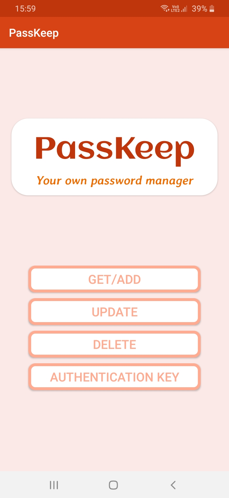
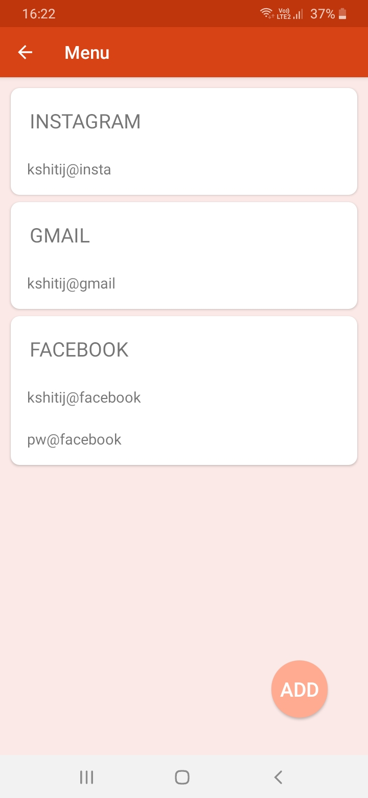
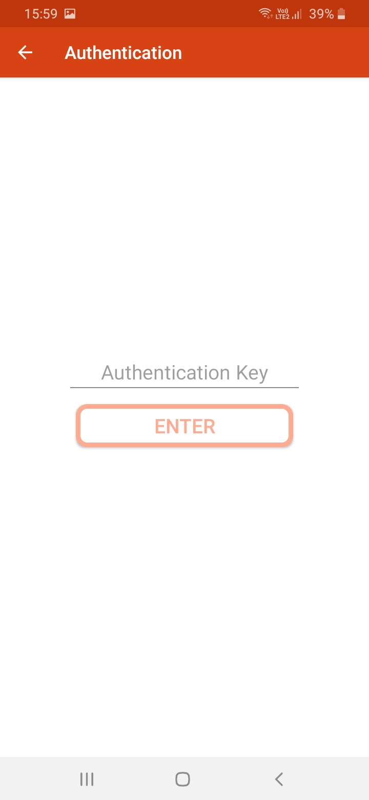

# PassKeep
## Your own password manager

### Description:
In this online world, we have alot of accounts at various websites and it's not safe to keep all of their passwords safe but also easy to remember to all those passwords(atleast for me).
So PassKeep saves you from this. You can add website name, username, password in it. It has a pin as well to safe your password details from others. All the data is stroed in an internal database. 

### Screenshots
#### Main screen

#### Data

#### Authentication key

